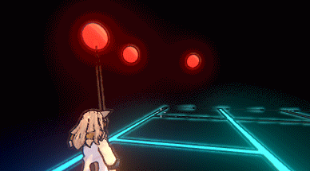
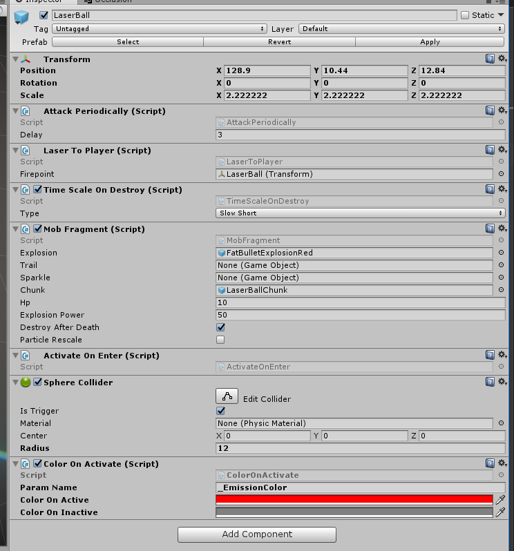

CBD.unity
====

Demonstrates how to make a game with Unity's component system and messages.

 

Pros
----
* Easy to reuse.
* No dependencies, No linkage above components.
* Lines of each components < 20.
* Feels good.